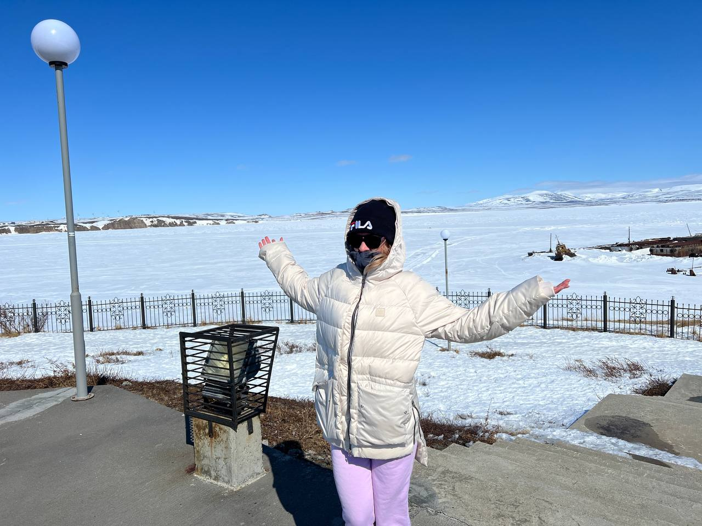

# МОЕ ПЕРВОЕ ОБУЧЕНИЕ IT ПРОФЕССИИ #
## Немного о себе ##
Привет! Меня зовут Юлия и вот почти год как я переехала жить из солнечной южной столицы г. Ростов - на - Дону в совершенно противоположный по климату  город - Анадырь. Здесь начинается день! И вот уже середина мая, а у нас идет снег. Так вот, чтоб не сойти с ума в этом милом месте, я решила себя занять и купила обучение для того чтобы  в будущем была возможность работать удаленно не смотря на мое местоположение. До переезда моя сфера деятельности была связана с торговлей, но пришлось все оставить, поэтому удаленная работа для меня очень актуальна! 
Жизнь на Чукотке размеренная и спокойная, никто никуда не спешит, развлечений как таковых нет, поэтому спортзал - единственное место где можно отлично провести время!!!! Это моя отдушина!
Ну и в заключении хочется сказать спасибо создателям онлайн обучения за возможность развиваться и заниматься полезным делом даже находять на краю Земли! Надеюсь у меня все получится! 

